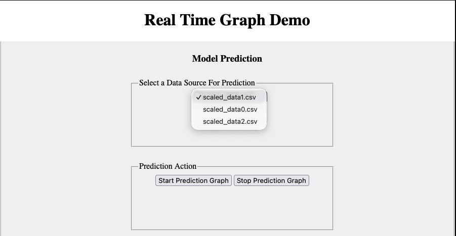

# WorkingDemos-RealTimeGraph1

This demo shows how to create a simple Flask web application that maintains a real time plot from data artificially generated to simulate real time data generation.  In particular the demo shows how to "push" data from a server side data source to the browser where a plot is updated each time a new data point is made available.  

## Summary

The Javascript `EventSource` class is used to establish a persistent HTTP connection between the browser and a server. This provides one-way communication from the server to the browser. Once the connection is established, the server can continuously send messages (Server-Sent Events or SSE) containing new data points to the browser.  JavaScript running in the browser can then process those data points and use Plotly.js to update the plot.

The persistent HTTP connection differs from a typical HTTP request-response interaction in that, with SSE, the server keeps the HTTP response open and can continue sending messages to the browser as new data becomes available. In a typical HTTP request-response interaction, the server sends its response and the request is then completed, allowing the connection to be closed.

A high level view of the design is:
- The server receives data from a remote source
- The data is put into Json form and is then sent, using the SSE mechanism, to the connected browser as a message.
- On the browser side, the message containing the Json data is unpacked using Javascript.
- The Javascript Plotly.js is used to update the currently displayed plot with the new point data.  The data points are simply added to the plot without having to re-render the whole plot.
- The plot is configured so as time goes by and more data points are added, the plot will scroll the older data out of view.
  

[View Documentation](docs/PlotRealTimeData2.md)

The server side code is written in Python 3.11 and the client browser code is written in pure HTML5 and Javascript.  The Javascript library, plotly.js is used to render the graph on the browser.

The web framework used is Flask 2.0.1.  However, the code was designed to be independent of the web framework.  For example, if you wish to use Django instead of Flask, just rewrite wsgi.py and replace all Flask dependencies with those from Django.  Nothing else in the project would need to be changed.

Make sure you have a path set to your Python interpreter.

In order to start the Flask server, cd to the folder WorkingDemos-RealTimeGraph1

Then run the server
  python3 wsgi.py
  
You will see in the console:

* Serving Flask app "wsgi" (lazy loading)
 * Environment: production
   WARNING: Do not use the development server in a production environment.
   Use a production WSGI server instead.
 * Debug mode: on
 * Running on http://127.0.0.1:5001/ (Press CTRL+C to quit)
 * Restarting with stat
 * Debugger is active!
 * Debugger PIN: 280-880-487

Notice that the response in the console shows a url of your web application:

http://127.0.0.1:5001

If you then enter this url into your browser, you will see the opening page of the web application:

The user interface is simple.  Just select a data source (there are 3) and click on the 
"Start Prediction" button.  You can stop the plot with the "Stop Prediction Graph".
