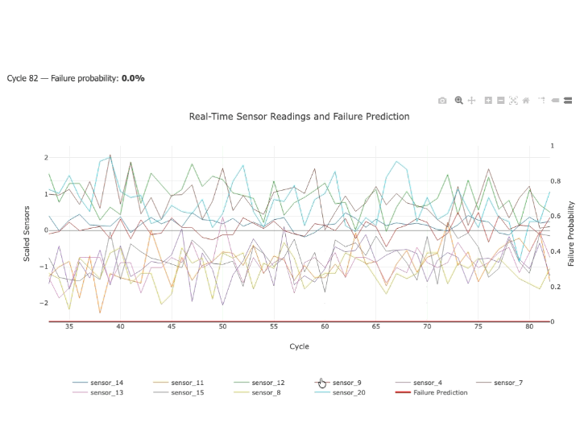

# Plot Real Time Data: Demo Flask Application

**By Dr. Eli Guidera**  
eliguidera45@gmail.com  
2022-09-08


# Plot Real Time Data: Demo Flask Application




This document explains how to plot a real time graph of time series data. In particular, time series data
is created on the server, and selected data is pushed to the client browser where a JavaScript library
called plotly.js updates the graph as data is made available. The code for a complete web application
is found on GitHub at: https://github.com/guiderae/WorkingDemos-RealTimeGraph1

In order to follow along, please go to this GitHub repository and download the project as a zip file and
unzip the project in a convenient location on your computer. You can then refer to the source code in
the specified files.

This document will use excerpts from the above mentioned repository to trace the steps necessary to
start and maintain a plot of real time data. The source of the data used for plotting can be found at
https://www.kaggle.com/datasets/nphantawee/pump-sensor-data. Code on the server side of the web
application will read the data and will periodically make rows of data available to the app thereby
simulating real time data generation.

The following discussion traces the whole process from clicking on a Start button to the maintenance of
a real time graph that is viewed in the browser. There are a number of parts that have to be put into
place in order to facilitate the real time graph.

Those parts include:

           - HTML code that defines start and stop buttons, a pull down that allows the user to select
             the data source, and a div element where the graph will be placed on the web page. The
             HTML code is written in a file templates/main.html.
           - JavaScript code that retrieves the data source that was selected in the browser, creates a
             connection to the data source, provides listeners that monitor and respond to messages
             sent by the server. The JavaScript code to accomplish these tasks is written in a file
             static/messageHandler.js
           - Python code that periodically generates and yields the data. This Python code is found in
             the file dataprep/data_source_manager.py
           - Python code that puts the generated data into a JSON format so that it can be streamed to
             the browser. This code is found in the file dataprep/process_real_time_data.py.
           - JavaScript code that defines the layout of the graph and adds new data to the graph. This
             code is found in static/plot.js
           - Python code that serves as a controller/mapper that maps URLs to Python actions. This
             code can be found in wsgi.py

We will therefore trace both client side and server side code.

## User Interface: HTML
The user interface code is in the file, templates/main.html. We are only interested in three code
segments:

### 1. HTML code that defines the select drop down that contains the names of the data sources:
```html
      21       <select id="predictCSV" >
      22           
      23               <option value="{{ onefile }}">{{ onefile }}</option>
      24           
      25       </select>
```
Note that the id of the select element is “predictCSV”

### 2. The div that contains the "Start Prediction Graph" button:
```html
28      <fieldset class="spanTwoCols">
29          <legend> Prediction Action</legend>
30          <div id="predBtnContainer" class="spanTwoCols">
31              <button id="startPredictBtn">Start Prediction Graph</button>
32              <button id="stopPredictBtn">Stop Prediction Graph</button>
33          </div>

34      </fieldset>
```
### 3. And the code segment that contains the div in which the graph will be placed:
```html
36      <div id="predGraph" class="predictGraphDiv"></div>
```

Line 31 contains a `<button>` element whose id is ‘startPredictBtn’. In order to support browser actions
such as button clicks, we need to add some JavaScript code to the html page. It is good programming
practice to separate HTML markup from JavaScript code, so we place the JavaScript in a file:
static/messageHandler.js, and then include the contents in this file in the HTML file with the `<script>` element:
```html
43      <script src="static/messageHandler.js"></script>
```

In anticipation of preparing the page for the real time graph, we will also make use of JavaScript in another file called plot.js, so we also add a `<script>` element for its inclusion:
```html
44      <script src="static/plot.js"></script>
```

We typically place the `<script>` elements at the bottom of the HTML `<body>` element. This practice
ensures that the HTML is loaded first and prevents any premature JavaScript reference to HTML
elements before they are loaded.

NOTE: JavaScript is part of the HTML5 definition. Whereas HTML defines elements and their
structure in a web page, JavaScript is used to provide support for user actions such as mouse
clicks on those elements. There is an intimate relationship between JavaScript and the HTML
on a web page. When a web page gets loaded into a browser, the HTML is parsed into a
structure called the Document Object Model (DOM). JavaScript is then able to access the DOM
and create JavaScript objects that represent elements within the DOM. It is through the
JavaScript objects that we can actually manipulate DOM elements. That is, we can
programmatically change properties of HTML elements during runtime based on user actions.

We can now look at some of the code in the messageHandler.js file.

## Browser side JavaScript code
```javascript
01   // This script first creates listeners for the start and stop buttons.
02   // It also creates an EventSource that is linked to the url,
03   // '/runPredict'. Once instantiated, theEventSource establishes a
04   // permanent socket that only allows server push communication. In this
05   // application there are two event messages that are pushed to the
06   // browser: 'update', and 'jobfinished'. There is also a listener for
07   // 'initialize', but it is not needed in this application.
08   const startPlotBtn = document.getElementById("startPredictBtn");
09   const stopPlotBtn = document.getElementById("stopPredictBtn");
10   const predictCSVNameObj = document.getElementById("predictCSV");
11   startPlotBtn.addEventListener('click', startPlotProcess);
12   stopPlotBtn.addEventListener('click', stopPlotProcess);
13
14   let eventSourceGraph;
15   function startPlotProcess(){
16       // Get the data source file name from the UI
17      let predictCSVName =
18           predictCSVNameObj.options[predictCSVNameObj.selectedIndex].text;
19       const url = "/runPredict?" + "predictCSVFileName=" + predictCSVName;
20       initPlot();
21       if(eventSourceGraph){
22           eventSourceGraph.close();
23       }
24       // Create a JS EventSource object and give it the URL of a long
25      // running task. The EventSource object keeps the connection open
26      // to the given URL so that the process at the end point
27      // can send messages
28      // back to the EventSource object.
29      eventSourceGraph = new EventSource(url);
30       // NOTE: This event 'initialize' is currently not used
31      eventSourceGraph.addEventListener("initialize",
32                                   function(event){
33           initPlot();
34       }, false);
35       // "update" Event contains the plotting data
36      eventSourceGraph.addEventListener("update",
37                                   function(event){
38           updatePlot(event.data);
39
40       }, false);
41       // "jobfinished" Event gets back finished message generated by the
42      // server when the data source is exhausted
43      eventSourceGraph.addEventListener("jobfinished",
44                                   function(event){
45           eventSourceGraph.close();
46           startPlotBtn.disabled = false;
47       }, false);

48         startPlotBtn.disabled = true; // Disable start btn after plot is started.
49     }
50     // Closes the EventSource object which closes the connection between
51     // browser and server.
52     function stopPlotProcess(){
53         console.log("Stopping process");
54         eventSourceGraph.close();
55         startPlotBtn.disabled = false; // Enable start btn after process
56        // is terminated.
57     }
```

First job is to add an EventListener to the ‘startPredictBtn’ that handles the button ‘click’ event.
JavaScript allows a short-hand format to accomplish this, but we will do it in two lines. The first line is:
```javascript

8      const startPlotBtn = document.getElementById("startPredictBtn");
```

The variable called startPlotBtn is a JavaScript object that represents the HTML element whose id is
“startPredictBtn”. Now that we have a JavaScript object, we can add a property to that object. We add
an EventListener to the button object:
```javascript
11      startPlotBtn.addEventListener('click', startPlotProcess);
```

The line 11 above adds a ‘click’ event to the button object and assigns a JavaScript function named
‘startPlotProcess’ that will handle the ‘click’ event on the button. If you look at the file,
static/messageHandler.js, you will find the JavaScript header definition for the function
startPlotProcess():
```javascript
15      function startPlotProcess(){......
```

There are three tasks in the function, startPlotProcess() that are of special interest:

         1. Create a JavaScript object, EventSource and give it a url that will be sent to the server.
            As we will see later, this url is mapped to code on the server that will get the data we need
            for the plot. The EventSource object will create a one-way socket connection to the
            server so that the server code can “push” data to the browser where that data will be
            added to our real time graph. See elaboration below that describes what “push” means.
         2. Initialize a Plotly object and call upon its newPlot() method.
         3. Add event listeners to the EventSource object that reacts to the different kinds of
             messages that will be received from the server. In our case the server code will generate
             only two types of messages: “update” and “jobfinished”. A message that is identified as
             “update” will contain data for plotting. A message that is identified as “jobfinished” has no
             data and is just used as a signal that there is no more data to push.

    


What does it mean to “push” data? When used over a network such as the Internet,
communication between two endpoints is facilitated by what is called a socket. Simply put, a
socket connection is made between two endpoints and data is sent/received by the two
endpoints. The HTTP protocol uses a restricted form of a socket where a request is made by
one endpoint called the client and the other endpoint called the server receives, processes the
request, and sends a response back to the client endpoint. Once the response is received by
the client, the socket connection is terminated. The JavaScript EventSource is another
restricted form of socket communication. First, a client request is sent to the server, and a
one-way socket is created. The server then receives the request, processes the request and the
socket remains open for the server to send multiple responses back to the client without
closing the connection. This type of communication is sometimes called “Push”. You can see
examples of “Push” on financial web sites where market data is pushed in real time without
further client requests. You can also go to sports web sites where real time game information is
pushed to the client without any further requests.

We will now provide code that accomplishes the three tasks listed above. We wish to create a url that
will have as its base, ‘/runPredict’. But we need to include a parameter in the url that contains the
name of the file that contains the data to be plotted. We retrieve the chosen data source file name in
lines 17 and 18. The variable, predictCSVNameObj is the JavaScript object that represents the HTML
select element whose id is ‘predictCSV' that was obtained in line 10. The variable 'predictCSVName'
defined in line 17 will contain the name of the data source. Finally, in line 19 we create the url with the
base value plus a parameter named ‘predictCSVFileName’ . Notice that the url is just a string
concatenation of the base url plus the parameter name with its value.
```javascript
17      let predictCSVName =
18          predictCSVNameObj.options[predictCSVNameObj.selectedIndex].text;
19      const url = "/runPredict?" + "predictCSVFileName=" + predictCSVName;
```
If you have never created a url with parameters, the format is:
```
baseURL?param1Name=param1value&param2Name=param2value……..
```

We next create an EventSource object and pass the above url to its constructor:
```javascript
29           eventSourceGraph = new EventSource(url);
```
This line of JavaScript code creates an EventSource object whose constructor makes a connection with
the server by using the given url. Later we will examine the server code that responds to this url.

Lines 21-23 make sure that we are not using an old EventSource object from a previous connection
that was not properly closed.
```javascript
21            if(eventSourceGraph){
22                eventSourceGraph.close();
23            }
```
Line 20 calls a JavaScript function that is found in static/plot.js:
```javascript
20            initPlot();
```
We will examine this function later.

As was stated earlier, the server will send only two types of messages: “update” and “jobfinished”. So
in the JavaScript code, we add listeners to the eventSourceGraph object that will respond to the receipt
of these two kinds of messages:
```javascript
35           // "update" Event contains the plotting data
36          eventSourceGraph.addEventListener("update",
37                                        function(event){
38               updatePlot(event.data);
39
40           }, false);
41           // "jobfinished" Event gets back finished message generated by the
42          // server when the data source is exhausted
43          eventSourceGraph.addEventListener("jobfinished",
44                                        function(event){
45               eventSourceGraph.close();
46               startPlotBtn.disabled = false;
47           }, false);
48           startPlotBtn.disabled = true;//Disable start btn after plot is started.
49      }
```
Line 36 adds an EventListener that will respond to the “update” message. An anonymous function calls
a JavaScript function, updatePlot(event.data). This function is written in the JavaScript file, `static/plot.js`.
We will examine this function later.

Line 43 adds an EventListener that will respond to the “jobfinished” message. The anonymous function
closes the EventSource connection. The “Start Prediction Graph” button is set to be disabled while the
plot is running.


So far we have looked at the code on the browser side that prepared the browser to accept data. The
logical next step would be to look at the server side code that pushes the data to the browser. Instead,
we will stay on the browser side for now and look at how the browser actually implements the plotting
process.

There are two ways to graph data. One would be to generate on the server a new graph for each data
point that becomes available and push the whole graph to the browser. This would work if there is
enough time between data points to do the generation and push. But in general, it makes more sense
to push the small amount of data contained in each data point to the browser and let code on the
browser do the plot.

The code to handle the plot is found in `static/plot.js`:
```javascript
01     var graph = document.getElementById("predGraph");
02     let data = [
03         { // 0 Trace for Data points for sensor
04             x: [],
05              y: [],
06              mode: 'line',
07              marker: {color: 'red', size: 3},
08              xaxis:{type: 'date'}
09         },
10         { // 1 Trace for Data points for sensor
11             x: [],
12              y: [],
13              mode: 'line',
14              marker: {color: 'green', size: 3},
15              xaxis:{type: 'date'}
16         },
17         { // 2 Trace for Data points for sensor
18             x: [],
19              y: [],
20              mode: 'line',
21              marker: {color: 'blue', size: 3},
22              xaxis:{type: 'date'}
23         }];
24     // This array of empty traces is used whenever we need to restart a plot
25     // after it has been stopped.
26     // Since the array is empty, the restarted plot will start with no data.
27     let initData = [

28        { // Trace0 for Data points for sensor
29            x: [],
30             y: [],
31        },
32        { // Trace1 for Data points for sensor
33            x: [],
34             y: [],
35        },
36        { // 2 Trace for Data points for sensor
37            x: [],
38             y: [],
39        }];
40        let layout = {
41             title: {text: 'Failure Prediction',
42                     font: {size: 20},
43                     xanchor: 'center',
44                     yanchor: 'top'},
45             margin: {t:50},
46             xaxis: {type: 'date'},
47             yaxis: {range: [0, 1],
48                     title: 'Scaled Sensors',
49                     side: 'left'},
50
51             showlegend: true
52
53       };
54    // First do a deep clone of the data array of traces. The clone uses values from the
empty array, initData
55    // Then call Plotly.newPlot() using the cloned array of empty traces to start a new
plot.
56    function initPlot(){
57        data[0].x = Array.from(initData[0].x);
58        data[0].y = Array.from(initData[0].y);
59        data[1].x = Array.from(initData[1].x);
60        data[1].y = Array.from(initData[1].y);
61        data[2].x = Array.from(initData[2].x);
62        data[2].y = Array.from(initData[2].y);
63        Plotly.newPlot('predGraph', data, layout);
64    }
65    var msgCounter = 0; // Another way of shifting. Not used in this code.
66    function updatePlot(jsonData){
67        let max = 120;
68        let jsonObj = JSON.parse(jsonData);
69        // Unpack json, keys are:
70       //['timestamp', 'sensor_04', 'sensor_18', 'sensor_34']
71       let timestamp = jsonObj.timestamp;
72        let y1 =         jsonObj.sensor_04;
73        let y2 =         jsonObj.sensor_18;
74        let y3 =         jsonObj.sensor_34;

75         // Note there are three traces.
76        Plotly.extendTraces('predGraph',
77             {
78                 x: [[timestamp], [timestamp], [timestamp]],
79                 y: [[y1], [y2], [y3]]
80             }, [0, 1, 2], max); // The array denotes to plot all
81                                 // three traces(0 based). Keep only last
82                                 //max data points
83    }
```

The first thing we need to do is to create a JavaScript object that represents the `div` in which the plot will
be placed:
```javascript
1     var graph = document.getElementById("predGraph");
```
The lines 02-23 define an array of traces. In `plotly.js`, a trace is one curve in a graph. In our demo we
are plotting the scaled values of 3 columns of data. So there is one trace for each data column. Each
trace is specified by a JavaScript dictionary with key/value pairs. Here is one trace dictionary:
```javascript
03        { // 0 Trace for Data points for sensor
04            x: [],
05            y: [],
06            mode: 'line',
07            marker: {color: 'red', size: 3},
08            xaxis:{type: 'date'}
09        }
```

Notice that we define the x and y coordinates of each point in lines 04-05. The keys, x and y are arrays
of values that represent the coordinates of all the data points so far received. We define the mode of
the plot to be a ‘line’ ( as opposed to ‘markers’ to plot points). We define the marker as a ‘red’ line with
size 3. Finally we specify that the xaxis is a date so that the timestamps will be formatted properly. You
can also see that the variable, data, is just an array of traces.

Lines 27-39 define a variable, initData which looks like a repetition of the definition of the array, data.
The purpose of initData is to serve as an ‘initializer’. That is, since initData defines traces with no data,
we will use initData to initialize our plotting data, (the array data) to be empty. The initData is used
between plots in order to erase the data from a previous plot. The initialization ( which is called from
the function `startPlotProcess()` on line 20 of `static/messageHandler.js` ) is done with the function
`initPlot()` in lines 56-62. The final line (63) of `initPlot()` calls upon Plotly’s `newPlot()` function, which sets
additional div’s inside our `predGraph` div. There are also a number of `svg` elements that get placed
within the graph div.

The lines 40-53 define a variable, layout, which specifies the layout of the graph such as size, font size,
legend, etc.

The three parameters passed to `newPlot()` are the id of the graph `div` where the plot will be placed, the
variable, `data` that contains the array of plot traces, and the graph layout.

```javascript
63         Plotly.newPlot('predGraph', data, layout);
```
Finally, on line 66 we define the most important function, `updatePlot()`. Remember that this function was
called from the `EventListener` in line 38 of `static/messageHandler.js`. The function, `updatePlot()` gets
called every time a new message of type “update” is received by the browser. This function takes one
parameter, which is a JSON string representation of one data point that we wish to add to the plot. This
JSON string is pushed from the server when a new data point becomes available. We will reproduce the
whole function here since it is very important:
```javascript
66    function updatePlot(jsonData){
67        let max = 120;
68        let jsonObj = JSON.parse(jsonData);
69        // Unpack json, keys are:
70       //['timestamp', 'sensor_04', 'sensor_18', 'sensor_34']
71       let timestamp = jsonObj.timestamp;
72        let y1 =        jsonObj.sensor_04;
73        let y2 =        jsonObj.sensor_18;
74        let y3 =        jsonObj.sensor_34;
75        // Note there are three traces.
76       Plotly.extendTraces('predGraph',
77            {
78                x: [[timestamp], [timestamp], [timestamp]],
79                y: [[y1], [y2], [y3]]
80            }, [0, 1, 2], max); // The array denotes to plot all
81                                // three traces(0 based). Keep only last
82                                //max data points
83    }
```

The local variable, `max` specifies how many data points will be maintained within the plot. So for
example if the value of max is 120, Plotly will start horizontally scrolling the data after 120 data points
have been plotted. This implies that only 120 data points will be visible at any one time. The values of
the points that are scrolled off the screen are lost.

Lines 68-74 unpack the values from the jsonData string object. There are only 4 values that we need to
plot a data point: a timestamp and three y-values representing the sensor data. We call these 4 values
timestamp, y1, y2, y3.

Line 76 calls Plotly’s extendTraces() function which adds the new data point to the graph. The function
`extendTraces()` takes 4 parameters:

           - Id of the div where the graph is drawn
           - A dictionary of x and y pairs to be plotted. Notice for example that the value of the x key
             is a list of lists. Same goes for the y key.
           - An array of trace numbers that is zero based. (first trace is trace 0). The value, [0, 1, 2]
             means to plot all 3 traces.
           - Max number of points to be displayed at one time.

Now you can see how the JSON data are plotted by code on the browser. The next question is “how
does the server prepare and push this JSON data to the browser.

## Server Side Python Code
There are two Python files that work on the server side: `dataprep/data_source_manager.py` and
`dataprep/process_realtime_data.py`. Here is part of the `data_source_manager.py`:
```javascript
01     class DataSourceManager:
02         """Used as a data source that periodically yields timeseries data points
03        """
04        @staticmethod
05        def csv_line_reader(path, file_name):
06             """Use data from a csv to periodically yield a row of data
07            :param path: Path to file
08            :param file_name: Name of csv file as source of data
09            :return: none
10            ..notes:: This static method has no return. Instead, it yields a row of            data that has been read from
11            a data source. The row is yielded as a dictionary
12            """
13            with open(join(path, file_name), 'r') as read_obj:
14                 dict_reader = DictReader(read_obj)
15                 for row in dict_reader:
16                      #print("row in reader: {}".format(row))
17                    time.sleep(1 / 10)
18                      yield row
```
The above is a part of the class, `DataSourceManager`. Only the part that is relevant to this demo is
included. In the full Failure Prediction Application, this class has another method that deals with getting
data from a Kafka data source.

The method, `csv_line_reader()` takes as parameters, path and file name of the csv data source. The
purpose of this method is to read the csv data, and yield a row of data at a rate of 10 per second. On
line 14 we use a DictReader to collect data points from the csv file being read. A `DictReader` in **Python**
is what is called an iterable. We can use a for-in loop to iterate through the DictReader. Inside the for-in
loop, we wait 1/10 th of a second and then `yield` a row.

Notice that in line 18 we do not use the keyword `return` because that keyword would terminate the
iteration through the `DictReader`. The keyword `yield` makes the value, row available to what is called a
consumer. We say that the class method, `csv_line_reader()` is a `generator`. So whatever code calls the
`generator` is called a `consumer`. There is a complex mechanism within **Python** that orchestrates the
relationship between generators and their consumers. Rather than using the return mechanism of
normal functions, a generator does not yield its value until the consumer is ready to receive it.

You can read more about generators/consumers [here](https://stackabuse.com/python-generators).

The consumer of the `csv_line_reader()` is written in the **Python** file `dataprep/process_realtime_data.py`.
Within this **Python** file we create a class called `ProcessRealtimeData`. Its constructor takes three
values:
```python
01    def __init__(self, csv_path, csv_filename, col_names):
02        """Class initializer (Constructor)
03
04        :param csv_filename: File name ( including path ) of the optional csv file
05        used as a data source
06        :type: string
07       :param csv_path: path to csv data
08       :type: string
09       :param col_names
10       :type: list of string
11       """
12       self.csv_filename = csv_filename
13       self.csv_path = csv_path
14       self.col_names = col_names
```

The first two parameters are self-evident. The third parameter, `col_names` is a list of the column names
whose values we wish to plot. These three values are stored in data members of the class in lines
12-14. There are only two methods in this class:
```python
01    def process_points(self):
02        """Process one point from the prediction data
03       This function is a generator that yields messages back to client.
04       The messages can be one of two types:
05       (1) event: update
06       (2) event: jobfinished

07       The message 'event: update' contains a json object associated with the
08       'data:' key. The json object contains the prediction data as well as
09       plotting data for two PC's (see self.__create_dict())
10       An external data source generator (DataSourceManager.csv_line_reader())
11       is used to retrieve prediction data one point at a time.
12       :return: none NOTE: This class method is a generator, so there is no
13       return. However it does yield a JSON serialized dictionary that contains
14       the data for plotting the prediction graph
15       """
16
17       # gen is a generator that is an iterable of dictionaries. Each dictionary
18       # contains one row of prediction data including timestamp and sensor data
19       gen = DataSourceManager.csv_line_reader(self.csv_path, self.csv_filename)
20
21        while True:
22            row = next(gen, None) # Get next row where row is a dictionary
23           if row is None:
24                # The value of this yield, when received by the client javascript,
25               # will shut down the socket that is used for pushing the
26               # prediction data.
27               yield "event: jobfinished\ndata: " + "none" + "\n\n"
28               break # Terminate this event loop
29           else:
30                plot_dict = self.__create_plot_dict(row)
31                dict_as_json = json.dumps(plot_dict)
32                yield "event: update\ndata: " + dict_as_json + "\n\n"
33
34    def __create_plot_dict(self, one_row_dict):
35        """Private method to create a dictionary
36       :param one_row_dict: One row as a DataFrame
37       :type: dictionary
38       :return: A dictionary of data that will be used for plotting the real time
prediction
39       """
40       # Get values of specified keys:
41       sensor_values = [one_row_dict[x] for x in self.col_names]
42        # Build new dict with specified col_names:
43       plot_dict = dict(zip(self.col_names, sensor_values))
44
45        return plot_dict
```

The class method `processPoints()` is a `generator` that will receive a row of data from
`DataSourceManager.csv_line_reader()`, and will then create a message that will eventually be sent to
the user through the `EventSource` socket.

In line 19 we receive a row object from the data generator. Remember that this row object is a **Python**
dictionary containing a row of data. We will create an infinite loop on line 21 that will keep executing as
long as there is data being received from the data `generator`. Line 22 gets a row from the generator.

We use the **Python** next to extract the next row from the iterable generator. The **Python** `next` function
takes two parameters: the `generator` and the **Python** keyword, `None`. If the `generator` is exhausted,
next will `None`. In line 23 we test the return value of `next`. If `None`, we create a message of the type
“jobfinished”.
```javascript
27                    yield "event: jobfinished\ndata: " + "none" + "\n\n"
```

The message format must be of the exact format:
```javascript
event: <name of event>\ndata: <data variable>\n\n
```
Notice that there are double spaces after the keywords `event:` and `data`: . Also notice the placement of
the ‘\n’ newlines.

If the value of row is not `none`, then we create a **Python** dictionary out of the row data (line 30), serialize
the **Python** dictionary ( line 31 ) and then `yield` the JSON as an “update” event in line 32:
```javascript
32                     yield "event: update\ndata: " + dict_as_json + "\n\n"
```

The `class` method, `__create_plot_dict()` simply extracts the required columns from the row dictionary
and creates a new dictionary that contains only the desired columns.

## Controller
The **Python** file, wsgi.py contains code that allows it to act as a web server. In line 01 below, we import
the class `Flask`. This class contains all the code that is needed to set up a web server. A web server is
a program that runs continuously and waits for url requests from the network(internet). Each url
request is mapped to some **Python** code that carries out some pre defined task.

Line 05 defines a variable, `app` that is an instance of the class `Flask`. In line 31 we call upon `Flask.run()`
that starts the Flask web server. The parameter, port is set to 5001. So if from the command line, cd to
the folder where `wsgi.py` is and then execute:
```bash
python wsgi.py
```
In the console you will see the response:

       * Serving Flask app "wsgi" (lazy loading)
        * Environment: production
          WARNING: Do not use the development server in a production environment.
          Use a production WSGI server instead.
        * Debug mode: on
        * Running on http://127.0.0.1:5001/ (Press CTRL+C to quit)

       * Restarting with stat
       * Debugger is active!
       * Debugger PIN: 280-880-487


Once the server is running, you can see that the application can be accessed through a browser by
using the url:

`http://127.0.0.1:5001`

Note that the base url is `127.0.0.1` and the port is 5001. The base url is assigned the ip address also
known as localhost since you are running this server application on your local machine.

The url, `http://localhost:5001` has the same meaning. When the server receives this url, it looks for
further information after the port number. If there is nothing specified after the port number, it assigns
the default url, “/” to the request. That is, the request actually looks like:

`http://127.0.0.1:5001/`

So besides setting the web server into motion, our `wsgi.py` also looks for URLs that it can map to some
Python actions.

The first url that we need to handle is the default “/”. Line 08 below shows that the url, “/” is mapped to
the Python function, main(). So when the url “/” is received, the function, main() is executed.

The function `main()` uses a utility class (in line 15) called `DataFileManager` found in
`utils/data_file_manager.py`. This class has one static method that finds all the file names in the path,
`static/data`.

Line 16 calls the Flask method, `render_template()` that renders `main.html` while passing the template
the list of file names. Those filenames will populate the select pull down in the user interface.
```python
01    from flask import Flask, render_template, Response, request
02    from dataprep.process_realtime_data import ProcessRealtimeData
03    from utils.data_file_manager import DataFileManager
04
05    app = Flask(__name__)
06
07
08    @app.route('/')
09    def main():
10        """
11       Get a list of the data file names found in static/data and pass
12       that list to the html page, main.html
13       :return: render_template()

14        """
15        csv_filenames = DataFileManager.get_file_names_in_path('static/data')
16         return render_template('main.html', filenames=csv_filenames)
17
18
19    @app.route('/runPredict')
20    def run_predict():
21        file_name_only = request.args.get('predictCSVFileName')
22        path = 'static/data'
23       col_names = ['timestamp', 'sensor_04', 'sensor_18', 'sensor_34']
24
25         rtd = ProcessRealtimeData(path, file_name_only, col_names)
26         rtd.process_points()
27         return Response(rtd.process_points(), mimetype='text/event-stream')
28
29
30    if __name__ == '__main__':
31        app.run(port=5001, debug=True)
32
33
```
Recall that when the button with id “startPredictBtn” was clicked, an `EventListener` for that button
catches the click event and executes the JavaScript function, `startPlotProcess()`` found in
static/messageHandler.js`. This function creates a url:
```javascript
19           const url = "/runPredict?" + "predictCSVFileName=" + predictCSVName;
``
If we had selected the file named “scaled_data1.csv, then the url would look like:
```javascript
/runPredict?predictCSVFileName=scaled_data1.csv
```
In line 29 we created a JavaScript `EventSource` object and passed this url to its constructor:
```javascript
29   eventSourceGraph = new EventSource(url);              (This is JavaScript)
```
The `EventSource` object sends out a request with the given url. Since all of our **Python** code is being
executed on localhost, the full url would look like:
```python
localhost:5001/runPredict?predictCSVFileName=scaled_data1.csv
```
So our controller, `wsgi.py` receives the url `/runPredict`, finds the mapping in line 19 and executes the
function, `run_predict()`. In the `run_predict()` function, line 21 gets the value of the request parameter
whose key is “predictCSVFileName”.

In line 22 we specify the path of the csv file. In line 23 we specify the column names of the data we
wish to plot.

In line 25 we create an instance of the class ProcessRealtimeData and pass the path, filename, and
column names to its constructor.

In line 26 we call upon the method `process_points()`. The code in this method was discussed
previously. Remember in that discussion, the method, `process_points()` acts as a `generator`. It `yields`
rows rather than returning them. There is one question remaining.

**How do the rows that process_points() yields get pushed to the browser? Remember that if
`process_points()` is a `generator`, then there must be a `consumer`.**

Line 27 in `wsgi.py` forwards the rows that were yielded by `process_points()` to the browser. Remember
that the JavaScript (browser side code) `EventSource` was created with the base url of `“/runPredict”.
Line 27 in wsgi.py returns one row of JSON data back to whomever requested the url “/runPredict”`:
```python
27           return Response(rtd.process_points(), mimetype='text/event-stream')
```
The Flask library has a class called `Response` that forwards the JSON data that was generated by the
Python `process_points()`. Notice that the mimetype parameter must be set to `‘text/event-stream’`.

## Conclusion
Even though we have examined in detail all the code that implements the requirements, the concept of
building a real time graph in the browser from data points generated on the server is actually simple
enough.
           1. The user starts the graph by clicking on a button in the UI and an `EventSource` object is
              created with the url ( `/runPredict` ) of the **Python** code that will generate the data one row
              at a time.
           2. The **Python** code that is mapped to the requested url ( `run_predict()` ) gets the data in the
              form of a `generator`.
           3. The data `generator` `yields` rows of data which are forwarded through a Flask class,
              `Response` back to the browser that made the `/runPredict` url request.